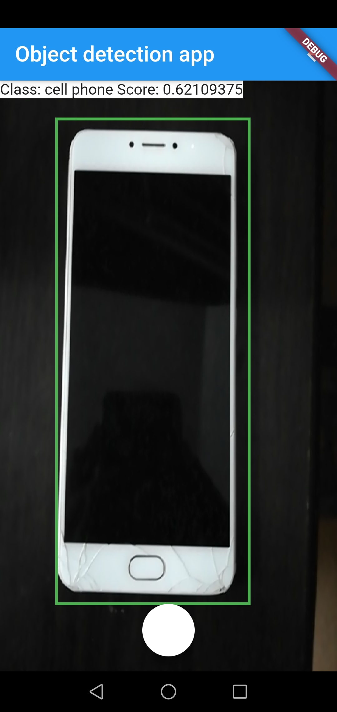
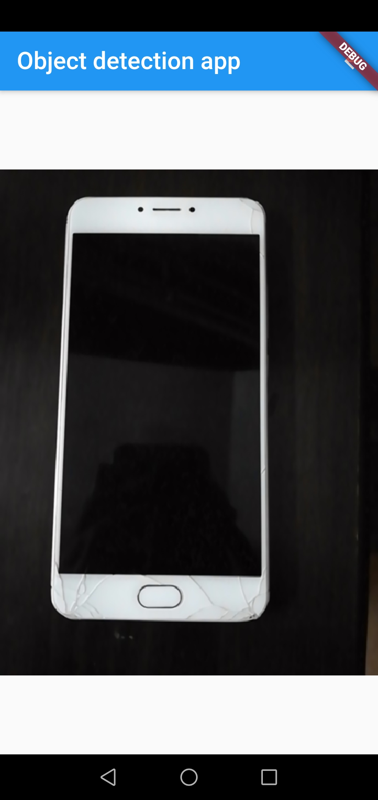

# Object detection on smartphone [WIP]
App to demonstrate object detection on smartphones using Flutter & Tensorflow Lite frameworks.

### Constrains
- min Sdk version 21 => Works with Android 5 & above
- Tested on Smartphone with Android 9 -- Works smoothly
- Tested on Smartphone with Android 6 -- Has issues

### Tech Stack
- Flutter
- Tensorflow Lite
- COCO SSD MobileNet Deep learning model

### TODOs
- Landscape mode
- Inffered box and label on saved image
- label at location of box
- measure performance
- exception handling
- Fix issues occuring on android 6

### How to use?
1. Open App -- Camera preview will be shown with detected objects in the bounding boxes with their class mentioned above
2. Press capture button to click image with objects in bounding boxes with their class mentioned above
3. Press the same button to go back and save that image

### Screenshots

- Near-real-time Object inference

- Image saved to Gallery

### How to run locally?
<!-- TODO -->

### Resources/References
- https://www.tensorflow.org/lite/models/object_detection/overview#get_started 
- https://api.flutter.dev/flutter/widgets/CustomPaint-class.html 
- https://pub.dev/packages/tflite
- https://pub.dev/packages/camera 
- https://pub.dev/packages/image 
- https://pub.dev/packages/permission_handler  
- https://medium.com/swlh/build-a-dog-camera-using-flutter-and-tensorflow-312022b716c6 
- https://pub.dev/packages/image_save 